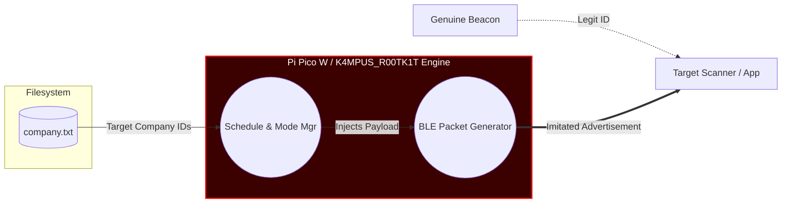
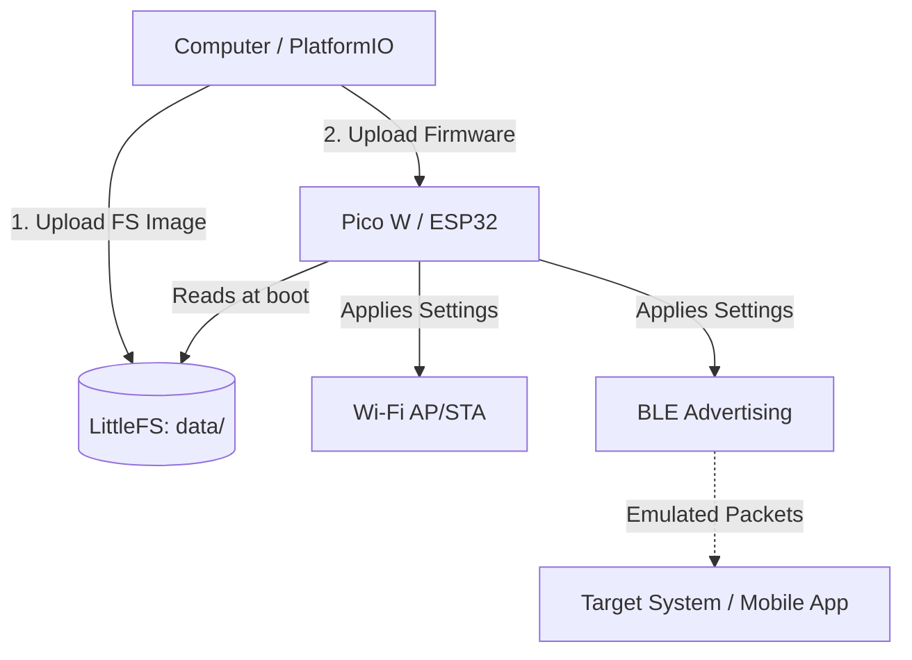

# K4MPUS_R00TK1T 📡

*🇹🇷 [Türkçe okumak için tıklayın (Read in Turkish)](README.tr.md)*

A Raspberry Pi Pico W / ESP32 based project focusing on Wi-Fi access (AP/STA modes), BLE device management, configurable scheduling, LED animations, and a local management interface.

## Disclaimer & Responsible Use ⚠️

**This project is intended strictly for educational purposes only.** 
The creators, contributors, and maintainers of this project do not endorse or encourage any illegal, unethical, or unauthorized activities. The user is solely responsible for ensuring that their use of this software complies with all applicable laws and regulations. The authors are not responsible for any misuse, damage, or legal consequences caused by the use of this project. By using this software, you assume all liability. Use at your own risk.

## Use Case & Purpose 🎯

This project is explicitly designed for **Bluetooth emulation (for educational and security auditing purposes)**. It can be utilized to analyze the accuracy, reliability, and security of applications or systems that rely on **Bluetooth tags or Company ID filtering**. By dynamically imitating BLE advertisements, researchers can validate how receiving systems handle unexpected, emulated, or modified BLE packets.

## Advanced BLE Emulation & Analysis 🔍

To illustrate how K4MPUS_R00TK1T can be used in an educational auditing scenario, here is a flowchart demonstrating Bluetooth Company ID imitation logic and system components. 

### BLE Company ID Imitation Architecture
This diagram demonstrates how the system can imitate specific Company IDs to test the fault-tolerance of a targeted access or tracking application. The red area highlights the Pi Pico engine's operation zone.

## Features ✨

- **BLE Emulation & Management**: Dynamically configure and transmit BLE advertisements (Company IDs, specific tags) for system analysis.
- **Dual/Multi-Mode Operation**: Wi-Fi configuration as AP or STA on demand.
- **LittleFS Configuration Management**: Device parameters are safely stored and read from the local file system (data/config).
- **Smart Scheduling**: Execute automated tasks at specific times via schedule.txt.
- **LED/Visual Notifications**: Device status notifications via LED effects.

## Working Mechanism ⚙️

The firmware relies on an onboard File System (LittleFS) to fetch run-time configurations, network credentials, and BLE structures. The general data flow is shown below:

| Component | Description |
| :--- | :--- |
| **LittleFS (data/)** | Stores configurations & web interface. **Must be flashed first.** |
| **Firmware** | The C++ logic handling file parsing, WiFi, and BLE emission. |
| **BLE Manager** | Emits targeted Company IDs and custom tags based on the config. |

## Getting Started 🚀

### 1. File Preparation

Before compiling the project for the first time or after cloning from GitHub, you must integrate the configuration templates into your project.

1. Copy all .example files located in data/config/ and remove the .example extension (e.g., company.txt.example -> company.txt).
2. Replace the dummy data in the .txt files with your actual local network or real application data.
3. Rename secrets.ini.example to secrets.ini in the root directory and configure it according to your environment.

*Note: The .gitignore is configured to ignore your actual .txt and secrets.ini files so that sensitive data will not be uploaded to your repository.*

### 2. Flashing the File System (IMPORTANT!)

Because this system relies on configuration files stored in the local partition, **you must upload the File System image via LittleFS before uploading the code**. Without this step, the device will have no configurations to read.

1. Open the **PlatformIO** sidebar in VS Code.
2. Navigate to **Project Tasks** -> nv:picow (or your active environment) -> **Platform**.
3. Click on **Upload Filesystem Image**.
*(This step transfers everything inside the data/ folder directly to the device's flash memory).*

### 3. Compilation & Upload

Once the File System is successfully flashed:

1. Open the PlatformIO sidebar.
2. Under **General**, click **Upload** (or run pio run -t upload in the terminal).
3. The device will reboot, read the configuration from LittleFS, and start emitting manipulated Wi-Fi and BLE signals.

## License
This project is licensed under the MIT License - see the [LICENSE](LICENSE) file for details.

