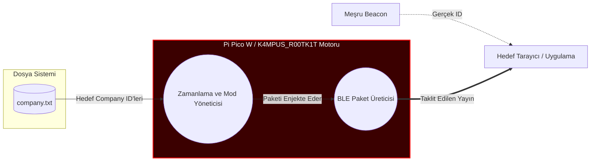
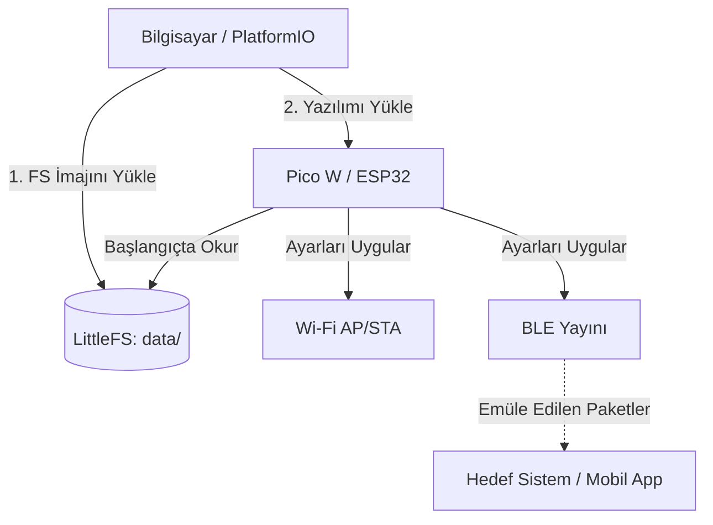

# K4MPUS_R00TK1T 📡

*🇬🇧 [Read in English](README.md)*

Raspberry Pi Pico W / ESP32 tabanlı bu proje; Wi-Fi erişimi (AP/STA modları), BLE cihaz yönetimi, yapılandırılabilir zamanlama, LED animasyonları ve yerel yönetim arayüzü üzerine odaklanmaktadır.

## Sorumluluk Reddi ve Bilinçli Kullanım ⚠️

**Bu proje kesinlikle ve yalnızca eğitim amaçlı tasarlanmıştır.**
Bu projenin yaratıcıları, katkıda bulunanları ve yöneticileri hiçbir yasadışı, etik dışı veya yetkisiz faaliyeti desteklemez ve teşvik etmez. Bu yazılımın kullanımının yürürlükteki tüm yasa ve düzenlemelere uygun olmasını sağlamak tamamen kullanıcının sorumluluğundadır. Yazarlar, bu projenin kullanımından kaynaklanan herhangi bir yanlış kullanım, hasar veya yasal sonuçtan sorumlu değildir. Bu yazılımı kullanarak tüm sorumluluğu üstlenmiş olursunuz. Riski size ait olmak üzere kullanın.

## Kullanım Senaryosu ve Amacı 🎯

Bu proje açıkça **Bluetooth emülasyonu (eğitim ve güvenlik denetimi amaçlı)** için tasarlanmıştır. **Bluetooth etiketlerine veya Company ID (Firma Kimliği) filtrelemesine** dayanan uygulamaların veya sistemlerin doğruluğunu, güvenilirliğini ve güvenliğini analiz etmek için kullanılabilir. Araştırmacılar, BLE yayınlarını dinamik olarak taklit ederek, alıcı sistemlerin beklenmeyen, taklit edilmiş veya değiştirilmiş BLE paketlerini nasıl işlediğini doğrulayabilirler.

## Gelişmiş BLE Emülasyonu ve Analizi 🔍

K4MPUS_R00TK1T'in eğitim amaçlı denetim senaryolarında nasıl kullanılabileceğini göstermek için, Bluetooth Company ID taklit mantığını ve sistem bileşenlerini gösteren bir akış şeması aşağıdadır.

### BLE Company ID Taklit Mimarisi
Bu diyagram, hedeflenen bir erişim veya izleme uygulamasının hata toleransını test etmek sistemin belirli Company ID'leri nasıl taklit edebildiğini göstermektedir. Kırmızı alan, Pi Pico motorunun çalışma bölgesini vurgular.

## Özellikler ✨

- **BLE Emülasyonu ve Yönetimi**: Sistem analizi için BLE yayınlarını (Company ID, belirli etiketler) dinamik olarak yapılandırın ve iletin.
- **Çift/Çoklu Mod Çalışma**: İsteğe bağlı olarak AP veya STA olarak Wi-Fi konfigürasyonu.
- **LittleFS Konfigürasyon Yönetimi**: Cihaz parametreleri güvenli bir şekilde yerel dosya sisteminde (data/config) saklanır ve okunur.
- **Akıllı Zamanlama**: schedule.txt aracılığıyla belirli zamanlarda otomatik görevler yürütün.
- **LED/Görsel Bildirimler**: LED efektleri aracılığıyla cihaz durum bildirimleri.

## Çalışma Mekanizması ⚙️

Yazılım, çalışma zamanı konfigürasyonlarını, ağ kimlik bilgilerini ve BLE yapılarını almak için yerleşik bir Dosya Sistemine (LittleFS) dayanır. Genel veri akışı aşağıda gösterilmiştir:

| Bileşen | Açıklama |
| :--- | :--- |
| **LittleFS (data/)** | Ayarları ve web arayüzünü saklar. **İlk olarak cihaza yüklenmelidir (flashlanmalıdır).** |
| **Firmware (Yazılım)** | Dosya çözümlemeyi, WiFi ve BLE yayınını işleyen C++ mantığı. |
| **BLE Yöneticisi** | Konfigürasyona dayalı olarak hedeflenen Company ID'lerini ve özel etiketleri yayınlar. |

## Başlangıç 🚀

### 1. Dosya Hazırlığı

Projeyi ilk kez derlemeden önce veya GitHub'dan klonladıktan sonra, konfigürasyon şablonlarını projenize entegre etmeniz gerekmektedir.

1. data/config/ klasöründe bulunan tüm .example dosyalarını kopyalayın ve .example uzantısını kaldırın (Örn: company.txt.example -> company.txt).
2. .txt dosyalarındaki geçici verileri kendi yerel ağınızın veya gerçek uygulamanızın verileri ile değiştirin.
3. Kök dizindeki secrets.ini.example dosyasını secrets.ini olarak yeniden adlandırın ve kendi ortamınıza göre yapılandırın.

*Not: .gitignore dosyası, gerçek .txt ve secrets.ini dosyalarınızı görmezden gelecek şekilde yapılandırılmıştır, böylece hassas veriler koda yansımaz.*

### 2. Dosya Sistemini (LittleFS) Yükleme (ÖNEMLİ!)

Bu sistem, yerel bölümde depolanan konfigürasyon dosyalarına bağlı olduğu için, **kodu derleyip yüklemeden önce LittleFS aracılığıyla Dosya Sistemi (File System) imajını yüklemelisiniz**. Bu adım olmadan, cihazın okuyacağı hiçbir yapılandırma olmaz.

1. VS Code'da **PlatformIO** kenar çubuğunu açın.
2. **Project Tasks** -> nv:picow (veya aktif ortamınız) -> **Platform** menüsüne gidin.
3. **Upload Filesystem Image** seçeneğine tıklayın.
*(Bu işlem, data/ klasörünün içindeki her şeyi doğrudan cihazın flash belleğine aktarır).*

### 3. Derleme ve Yükleme

Dosya Sistemi başarılı bir şekilde flashlandıktan sonra:

1. PlatformIO kenar çubuğunu açın.
2. **General** altında **Upload** seçeneğine tıklayın (veya terminalde pio run -t upload komutunu çalıştırın).
3. Cihaz yeniden başlayacak, konfigürasyonları LittleFS'ten okuyacak ve simüle edilmiş Wi-Fi ve BLE sinyallerini yaymaya başlayacaktır.

## Lisans
Bu proje MIT Lisansı altında lisanslanmıştır - detaylar için [LICENSE](LICENSE) dosyasına bakabilirsiniz.
